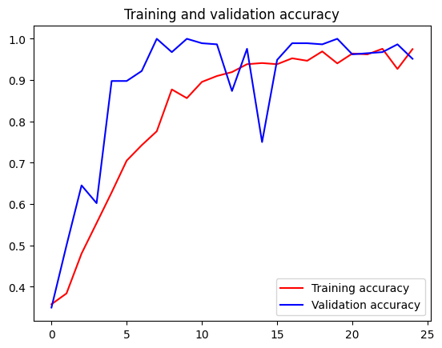

解压下载的数据集:


```python
import os
import zipfile

local_zip = '/workspaces/codespaces-jupyter/notebooks/floder/rps.zip'
zip_ref = zipfile.ZipFile(local_zip, 'r')
zip_ref.extractall('/workspaces/codespaces-jupyter/notebooks/floder/')
zip_ref.close()

local_zip = '/workspaces/codespaces-jupyter/notebooks/floder/rps-test-set.zip'
zip_ref = zipfile.ZipFile(local_zip, 'r')
zip_ref.extractall('/workspaces/codespaces-jupyter/notebooks/floder/')
zip_ref.close()
```

检测数据集的解压结果，打印相关信息:


```python
rock_dir = os.path.join('/workspaces/codespaces-jupyter/notebooks/floder/rps/rock')
paper_dir = os.path.join('/workspaces/codespaces-jupyter/notebooks/floder/rps/paper')
scissors_dir = os.path.join('/workspaces/codespaces-jupyter/notebooks/floder/rps/scissors')

print('total training rock images:', len(os.listdir(rock_dir)))
print('total training paper images:', len(os.listdir(paper_dir)))
print('total training scissors images:', len(os.listdir(scissors_dir)))

rock_files = os.listdir(rock_dir)
print(rock_files[:10])

paper_files = os.listdir(paper_dir)
print(paper_files[:10])

scissors_files = os.listdir(scissors_dir)
print(scissors_files[:10])

```

    total training rock images: 840
    total training paper images: 840
    total training scissors images: 840
    ['rock05ck01-028.png', 'rock06ck02-003.png', 'rock04-031.png', 'rock02-078.png', 'rock01-078.png', 'rock05ck01-113.png', 'rock04-000.png', 'rock01-109.png', 'rock04-040.png', 'rock05ck01-070.png']
    ['paper06-061.png', 'paper07-027.png', 'paper01-027.png', 'paper01-037.png', 'paper04-086.png', 'paper06-007.png', 'paper06-084.png', 'paper05-008.png', 'paper02-037.png', 'paper04-020.png']
    ['scissors03-065.png', 'testscissors03-055.png', 'scissors03-024.png', 'scissors04-020.png', 'scissors03-106.png', 'testscissors01-063.png', 'scissors02-052.png', 'testscissors02-038.png', 'scissors02-001.png', 'testscissors01-022.png']
    

各打印两张石头剪刀布训练集图片:


```python
%matplotlib inline

import matplotlib.pyplot as plt
import matplotlib.image as mpimg

pic_index = 2

next_rock = [os.path.join(rock_dir, fname) 
                for fname in rock_files[pic_index-2:pic_index]]
next_paper = [os.path.join(paper_dir, fname) 
                for fname in paper_files[pic_index-2:pic_index]]
next_scissors = [os.path.join(scissors_dir, fname) 
                for fname in scissors_files[pic_index-2:pic_index]]

for i, img_path in enumerate(next_rock+next_paper+next_scissors):
  #print(img_path)
  img = mpimg.imread(img_path)
  plt.imshow(img)
  plt.axis('Off')
  plt.show()

```


    

    


    

    


    

    


    

    


    

    


    

    


调用TensorFlow的keras进行数据模型的训练和评估


```python
import tensorflow as tf
import keras_preprocessing
from keras_preprocessing import image
from keras_preprocessing.image import ImageDataGenerator

TRAINING_DIR = "/workspaces/codespaces-jupyter/notebooks/floder/rps/"
training_datagen = ImageDataGenerator(
      rescale = 1./255,
	    rotation_range=40,
      width_shift_range=0.2,
      height_shift_range=0.2,
      shear_range=0.2,
      zoom_range=0.2,
      horizontal_flip=True,
      fill_mode='nearest')

VALIDATION_DIR = "/workspaces/codespaces-jupyter/notebooks/floder/rps-test-set/"
validation_datagen = ImageDataGenerator(rescale = 1./255)

train_generator = training_datagen.flow_from_directory(
	TRAINING_DIR,
	target_size=(150,150),
	class_mode='categorical',
  batch_size=126
)

validation_generator = validation_datagen.flow_from_directory(
	VALIDATION_DIR,
	target_size=(150,150),
	class_mode='categorical',
  batch_size=126
)

model = tf.keras.models.Sequential([
    # Note the input shape is the desired size of the image 150x150 with 3 bytes color
    # This is the first convolution
    tf.keras.layers.Conv2D(64, (3,3), activation='relu', input_shape=(150, 150, 3)),
    tf.keras.layers.MaxPooling2D(2, 2),
    # The second convolution
    tf.keras.layers.Conv2D(64, (3,3), activation='relu'),
    tf.keras.layers.MaxPooling2D(2,2),
    # The third convolution
    tf.keras.layers.Conv2D(128, (3,3), activation='relu'),
    tf.keras.layers.MaxPooling2D(2,2),
    # The fourth convolution
    tf.keras.layers.Conv2D(128, (3,3), activation='relu'),
    tf.keras.layers.MaxPooling2D(2,2),
    # Flatten the results to feed into a DNN
    tf.keras.layers.Flatten(),
    tf.keras.layers.Dropout(0.5),
    # 512 neuron hidden layer
    tf.keras.layers.Dense(512, activation='relu'),
    tf.keras.layers.Dense(3, activation='softmax')
])


model.summary()

model.compile(loss = 'categorical_crossentropy', optimizer='rmsprop', metrics=['accuracy'])

history = model.fit(train_generator, epochs=25, steps_per_epoch=20, validation_data = validation_generator, verbose = 1, validation_steps=3)

model.save("rps.h5")

```

    2023-05-31 04:35:49.464703: W tensorflow/stream_executor/platform/default/dso_loader.cc:64] Could not load dynamic library 'libcudart.so.11.0'; dlerror: libcudart.so.11.0: cannot open shared object file: No such file or directory
    2023-05-31 04:35:49.464738: I tensorflow/stream_executor/cuda/cudart_stub.cc:29] Ignore above cudart dlerror if you do not have a GPU set up on your machine.
    

    Found 2520 images belonging to 3 classes.
    Found 372 images belonging to 3 classes.
    

    2023-05-31 04:35:59.850278: W tensorflow/stream_executor/platform/default/dso_loader.cc:64] Could not load dynamic library 'libcuda.so.1'; dlerror: libcuda.so.1: cannot open shared object file: No such file or directory
    2023-05-31 04:35:59.850321: W tensorflow/stream_executor/cuda/cuda_driver.cc:269] failed call to cuInit: UNKNOWN ERROR (303)
    2023-05-31 04:35:59.850352: I tensorflow/stream_executor/cuda/cuda_diagnostics.cc:156] kernel driver does not appear to be running on this host (codespaces-c507cb): /proc/driver/nvidia/version does not exist
    2023-05-31 04:35:59.851014: I tensorflow/core/platform/cpu_feature_guard.cc:151] This TensorFlow binary is optimized with oneAPI Deep Neural Network Library (oneDNN) to use the following CPU instructions in performance-critical operations:  AVX2 AVX512F FMA
    To enable them in other operations, rebuild TensorFlow with the appropriate compiler flags.
    

    Model: "sequential"
    _________________________________________________________________
     Layer (type)                Output Shape              Param #   
    =================================================================
     conv2d (Conv2D)             (None, 148, 148, 64)      1792      
                                                                     
     max_pooling2d (MaxPooling2D  (None, 74, 74, 64)       0         
     )                                                               
                                                                     
     conv2d_1 (Conv2D)           (None, 72, 72, 64)        36928     
                                                                     
     max_pooling2d_1 (MaxPooling  (None, 36, 36, 64)       0         
     2D)                                                             
                                                                     
     conv2d_2 (Conv2D)           (None, 34, 34, 128)       73856     
                                                                     
     max_pooling2d_2 (MaxPooling  (None, 17, 17, 128)      0         
     2D)                                                             
                                                                     
     conv2d_3 (Conv2D)           (None, 15, 15, 128)       147584    
                                                                     
     max_pooling2d_3 (MaxPooling  (None, 7, 7, 128)        0         
     2D)                                                             
                                                                     
     flatten (Flatten)           (None, 6272)              0         
                                                                     
     dropout (Dropout)           (None, 6272)              0         
                                                                     
     dense (Dense)               (None, 512)               3211776   
                                                                     
     dense_1 (Dense)             (None, 3)                 1539      
                                                                     
    =================================================================
    Total params: 3,473,475
    Trainable params: 3,473,475
    Non-trainable params: 0
    _________________________________________________________________
    

    2023-05-31 04:36:02.035244: W tensorflow/core/framework/cpu_allocator_impl.cc:82] Allocation of 34020000 exceeds 10% of free system memory.
    

    Epoch 1/25
    

    2023-05-31 04:36:05.095516: W tensorflow/core/framework/cpu_allocator_impl.cc:82] Allocation of 34020000 exceeds 10% of free system memory.
    2023-05-31 04:36:05.129116: W tensorflow/core/framework/cpu_allocator_impl.cc:82] Allocation of 706535424 exceeds 10% of free system memory.
    2023-05-31 04:36:05.972743: W tensorflow/core/framework/cpu_allocator_impl.cc:82] Allocation of 176633856 exceeds 10% of free system memory.
    2023-05-31 04:36:06.069025: W tensorflow/core/framework/cpu_allocator_impl.cc:82] Allocation of 167215104 exceeds 10% of free system memory.
    

    20/20 [==============================] - 81s 4s/step - loss: 1.4250 - accuracy: 0.3575 - val_loss: 1.0834 - val_accuracy: 0.3495
    Epoch 2/25
    20/20 [==============================] - 77s 4s/step - loss: 1.0937 - accuracy: 0.3837 - val_loss: 1.0847 - val_accuracy: 0.5000
    Epoch 3/25
    20/20 [==============================] - 76s 4s/step - loss: 1.0516 - accuracy: 0.4802 - val_loss: 0.7258 - val_accuracy: 0.6452
    Epoch 4/25
    20/20 [==============================] - 76s 4s/step - loss: 0.9573 - accuracy: 0.5540 - val_loss: 0.7725 - val_accuracy: 0.6022
    Epoch 5/25
    20/20 [==============================] - 74s 4s/step - loss: 0.7782 - accuracy: 0.6282 - val_loss: 0.3508 - val_accuracy: 0.8978
    Epoch 6/25
    20/20 [==============================] - 74s 4s/step - loss: 0.6690 - accuracy: 0.7052 - val_loss: 0.3359 - val_accuracy: 0.8978
    Epoch 7/25
    20/20 [==============================] - 72s 4s/step - loss: 0.5890 - accuracy: 0.7425 - val_loss: 0.2103 - val_accuracy: 0.9220
    Epoch 8/25
    20/20 [==============================] - 71s 4s/step - loss: 0.5063 - accuracy: 0.7762 - val_loss: 0.1120 - val_accuracy: 1.0000
    Epoch 9/25
    20/20 [==============================] - 82s 4s/step - loss: 0.3304 - accuracy: 0.8774 - val_loss: 0.1140 - val_accuracy: 0.9677
    Epoch 10/25
    20/20 [==============================] - 77s 4s/step - loss: 0.3672 - accuracy: 0.8563 - val_loss: 0.0530 - val_accuracy: 1.0000
    Epoch 11/25
    20/20 [==============================] - 73s 4s/step - loss: 0.2716 - accuracy: 0.8956 - val_loss: 0.0493 - val_accuracy: 0.9892
    Epoch 12/25
    20/20 [==============================] - 70s 3s/step - loss: 0.2333 - accuracy: 0.9099 - val_loss: 0.0360 - val_accuracy: 0.9866
    Epoch 13/25
    20/20 [==============================] - 72s 4s/step - loss: 0.2199 - accuracy: 0.9194 - val_loss: 0.2424 - val_accuracy: 0.8737
    Epoch 14/25
    20/20 [==============================] - 70s 3s/step - loss: 0.1723 - accuracy: 0.9385 - val_loss: 0.0676 - val_accuracy: 0.9758
    Epoch 15/25
    20/20 [==============================] - 71s 3s/step - loss: 0.1607 - accuracy: 0.9413 - val_loss: 0.4590 - val_accuracy: 0.7500
    Epoch 16/25
    20/20 [==============================] - 70s 3s/step - loss: 0.1657 - accuracy: 0.9385 - val_loss: 0.1377 - val_accuracy: 0.9489
    Epoch 17/25
    20/20 [==============================] - 72s 4s/step - loss: 0.1236 - accuracy: 0.9528 - val_loss: 0.0234 - val_accuracy: 0.9892
    Epoch 18/25
    20/20 [==============================] - 71s 4s/step - loss: 0.1433 - accuracy: 0.9468 - val_loss: 0.0305 - val_accuracy: 0.9892
    Epoch 19/25
    20/20 [==============================] - 69s 3s/step - loss: 0.0945 - accuracy: 0.9694 - val_loss: 0.0367 - val_accuracy: 0.9866
    Epoch 20/25
    20/20 [==============================] - 70s 3s/step - loss: 0.1808 - accuracy: 0.9405 - val_loss: 0.0164 - val_accuracy: 1.0000
    Epoch 21/25
    20/20 [==============================] - 70s 3s/step - loss: 0.1035 - accuracy: 0.9643 - val_loss: 0.0967 - val_accuracy: 0.9624
    Epoch 22/25
    20/20 [==============================] - 71s 4s/step - loss: 0.1074 - accuracy: 0.9623 - val_loss: 0.0802 - val_accuracy: 0.9651
    Epoch 23/25
    20/20 [==============================] - 68s 3s/step - loss: 0.0700 - accuracy: 0.9758 - val_loss: 0.0649 - val_accuracy: 0.9677
    Epoch 24/25
    20/20 [==============================] - 68s 3s/step - loss: 0.2325 - accuracy: 0.9270 - val_loss: 0.0288 - val_accuracy: 0.9866
    Epoch 25/25
    20/20 [==============================] - 69s 3s/step - loss: 0.0677 - accuracy: 0.9750 - val_loss: 0.1490 - val_accuracy: 0.9516
    

完成模型训练之后，我们绘制训练和验证结果的相关信息


```python
import matplotlib.pyplot as plt
acc = history.history['accuracy']
val_acc = history.history['val_accuracy']
loss = history.history['loss']
val_loss = history.history['val_loss']

epochs = range(len(acc))

plt.plot(epochs, acc, 'r', label='Training accuracy')
plt.plot(epochs, val_acc, 'b', label='Validation accuracy')
plt.title('Training and validation accuracy')
plt.legend(loc=0)
plt.figure()
plt.show()

```


    

    


    <Figure size 640x480 with 0 Axes>

